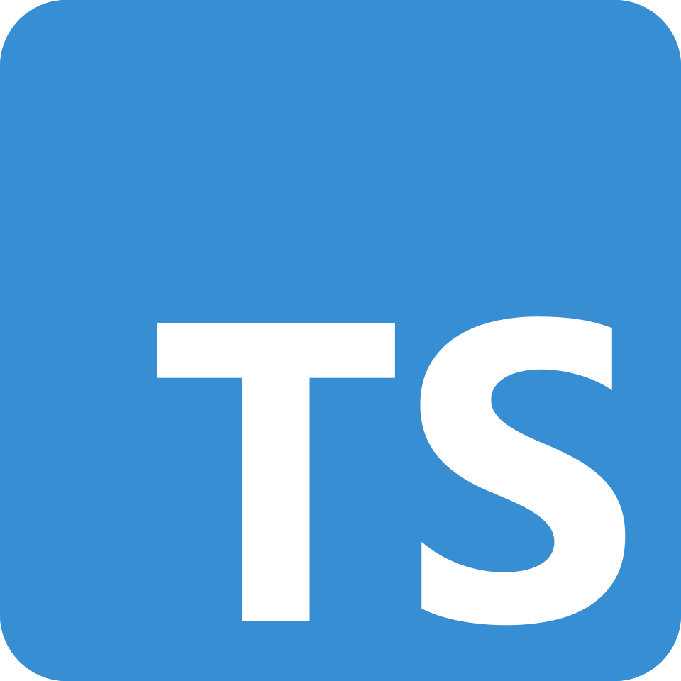
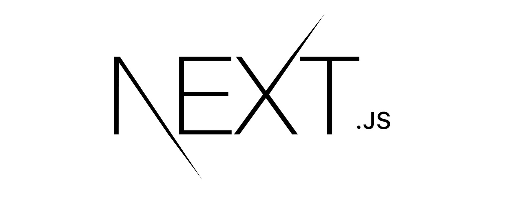
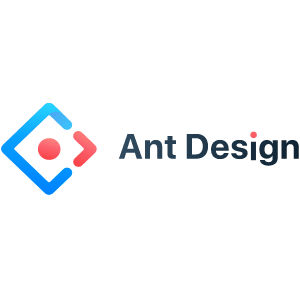

(Это форк основго приложения и за основу взят readme написанный Ириной Хрусталевой [ссылка на readme](https://github.com/RedFlagss/feature_flag_main))

# RED FLAGS

RedFlags — это SaaS-платформа для централизованного управления включением
и отключением функций в приложениях во время его работы (система управления фича-флагами).

Система включает в себя:

- Админ панель, для настройки структуры организации, создания и выдачи
  доступа сотрудникам, переключения фича-флагов (расположена в этом репозитории)
- SDK для клиентских приложений (хранится по [ссылке](https://github.com/RedFlagss/feature_flag_client))

Frontend хранится по [ссылке](https://github.com/RedFlagss/frontend-workshop)

# Стек технологий

Админ панель состоит из 2 микросервисов:

- Сервис авторизации: Java 21, Micronaut, PostgreSQL, Redis, Kafka
- Основной сервис: Java 21, Micronaut, Kafka, PostgreSQL

- Для микросервисов админ панели настроено хранение логов и сбор метрик: Grafana Alloy, Loki, Prometheus, Grafana

- SDK для клиентских приложений: Java 17, Kafka
- Frontend: TS, React, next.js, scss, casl, antd

# Мой вклад

- Создание макета приложения
- Написание графических компонентов
- Вёртска приложения с использованием antd
- Интеграция фронтенда с бекендом (основного сервиса и атуентификация)
- Настройка ролей и прав доступа
- Синхронизация данных при отличии в версиях
- Докер файл и имедж для сборки проекта с использование докер композера

## Используемые технологии

  

    
    TypeScript
  

  

    
    React
  

  

    
    Next.js
  

  

    
    SCSS
  

  

    
    Ant Design
  

  

    
    CASL
  

# Документация

## Архитектура

Микросервисы админ панели:

- Auth service - сервис авторизации. Работает с сессиями для ui пользователей,
  с jwt токенами для клиентов-сервисов; выдает доступы к kafka
- Feature-flag service - основной сервис. Сервис отвечает за работу с
  фича-флагами, организациями и звеньями организации.
  Звенья образуют древовидную структуру организации, которая хранится как ltree дерево

SDK для клиентских приложений:

SDK отвечает за интеграцию фича-флагов в клиентский сервис,
автоматическое получение актуальных значений флагов и синхронизацию
изменений в реальном времени через Kafka.

## UseCase - диаграмма

## Интерфейс

### Страница регистрации(организации/пользователя)/авторизации

  <strong>Десктоп</strong>
  

    
    
    
  

<strong style="display:block;margin-top:16px">Мобильная</strong>

  

    
    
    
  

### Меню профиля

  <strong>Десктоп</strong>
  

    
    
  

  <strong style="display:block;margin-top:16px">Мобильная</strong>

  

    
    
  

  
Интерфейс профиля: быстрый доступ к настройкам, переключение аккаунтов и управление уведомлениями.

### Организация

  <strong>Десктоп</strong>
  

    
    
  

  <strong style="display:block;margin-top:16px">Мобильная</strong>

  

    
    
    
  

  
Управление организацией: создание отделов\сервисов, создание пользователей, назначение ролей и просмотр структуры.

### Меню фич флагов

  <strong>Десктоп</strong>
  

    
  

  <strong style="display:block;margin-top:16px">Мобильная</strong>

  

    
    
  

  
Меню фич флагов: список фич флагов, быстрое переключение, добавление и фильтрация по названию и отделам.

# Развертывание

Для запуска админ панели необходимо запустить контейнеры docker через
docker-compose.

Логи и метрики не собраны в image docker, поэтому для запуска с ними
необходимо собрать микросервисы локально, изменив docker-compose из
ветки master. Настроенный docker-compose для сборки микросервисов
с логами и метриками находится в ветке logi. Перед его сборкой необходимо
собрать микросервисы через gradle.

SDK запускается отдельным проектом

# Работяги:

[Лиза Антипатрова](https://github.com/LizaAntipatrova) - java-developer, devOps engineer

[Семен Муравьев](https://github.com/SemionMur) - java-developer

[Ирина Хрусталева](https://github.com/rubberPlant256) - java-developer

[Кирилл Авдеев(Я)](https://github.com/DischargedRobot) - frontend-developer

[Дима Бряков](https://github.com/razondark) - Mentor

Т-банк зимняя проектная мастерская, март-апрель 2026
